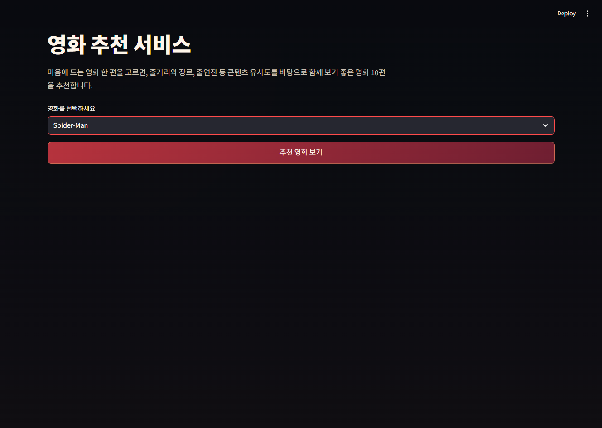
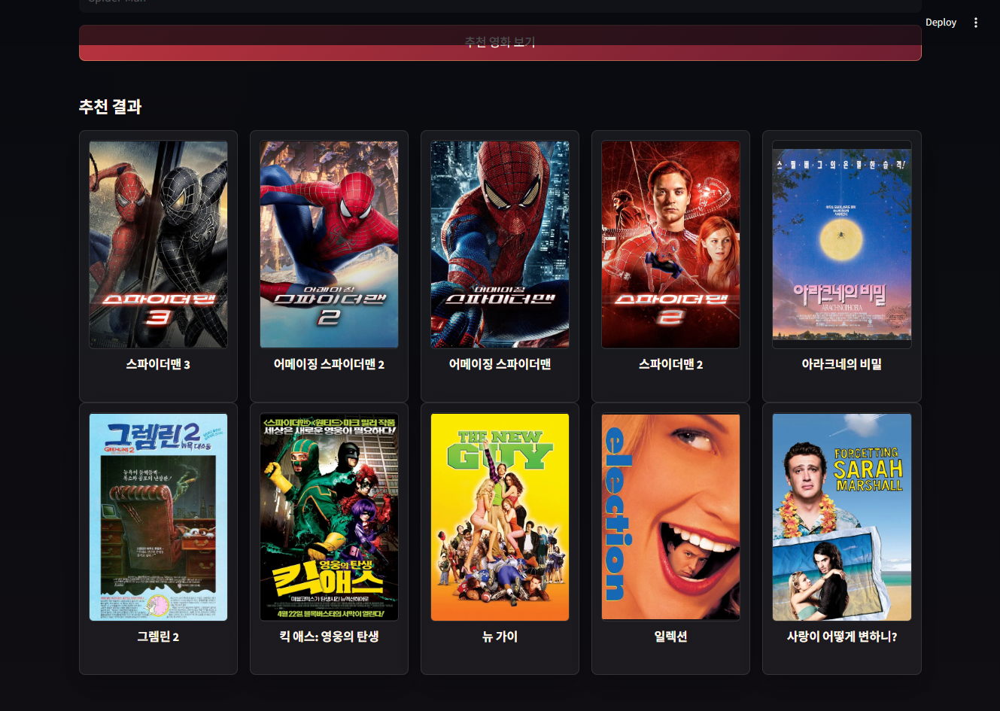
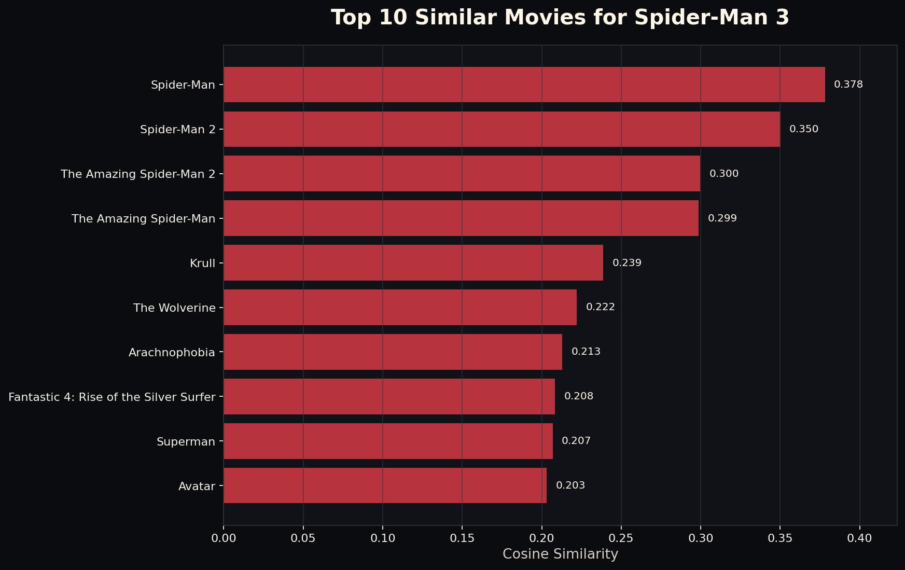

# 영화 추천 웹앱

Streamlit으로 만든 콘텐츠 기반 영화 추천 웹앱입니다. 사용자가 영화 제목을 선택하면 줄거리와 장르 정보를 바탕으로 비슷한 영화 10편을 추천합니다.



## 주요 기능

- 영화 제목 선택 기반 추천
- 선택한 영화와 유사한 영화 Top 10 표시
- TMDB API를 활용한 포스터와 한국어 제목 표시
- API 키가 없거나 포스터를 가져오지 못할 때 기본 이미지로 대체
- `cosine_sim2.pkl` 로딩 실패 시 `cosine_sim.pkl`로 자동 대체

## 추천 결과

추천 버튼을 누르면 영화 포스터와 제목이 카드 형태로 표시됩니다.



## 추천 방식

이 프로젝트는 영화의 줄거리(`overview`)와 장르(`genres`)를 하나의 추천 문장으로 합친 뒤, TF-IDF 벡터와 코사인 유사도를 사용해 비슷한 영화를 찾습니다.

```python
def create_recommendation_text(row):
    genre_text = " ".join(row["genres"])
    return f"{row['overview']} {(genre_text + ' ') * 3}".strip()
```

추천 흐름은 다음과 같습니다.

1. 영화 데이터에서 줄거리와 장르 정보를 가져옵니다.
2. 장르 정보가 추천 결과에 더 잘 반영되도록 장르 텍스트를 반복해 결합합니다.
3. `TfidfVectorizer`로 추천 문장을 벡터화합니다.
4. `cosine_similarity`로 영화 간 유사도를 계산합니다.
5. 선택한 영화 자신과 중복 영화를 제외하고 유사도가 높은 영화 10편을 반환합니다.



## 기술 스택

- Python
- Streamlit
- pandas
- numpy
- scikit-learn
- tmdbv3api
- python-dotenv
- matplotlib
- seaborn

## 프로젝트 구조

```text
.
├── app.py
├── requirements.txt
├── .env.example
├── README.md
├── assets/
│   ├── no_image.png
│   └── screenshots/
│       ├── select-movie.png
│       ├── recommendation-result.png
│       └── recommendation-similarity-chart.png
├── data/
│   ├── tmdb_5000_movies.csv
│   └── tmdb_5000_credits.csv
├── models/
│   ├── movies.pkl
│   ├── cosine_sim.pkl
│   └── cosine_sim2.pkl
└── notebooks/
    ├── Content Based Fitering.ipynb
    ├── create_recommendation_chart.py
    └── recommendation_model_example.py
```

## 설치 및 실행

필요한 패키지를 설치합니다.

```bash
pip install -r requirements.txt
```

Streamlit 앱을 실행합니다.

```bash
streamlit run app.py
```

실행 후 브라우저에서 Streamlit이 안내하는 로컬 주소로 접속하면 앱을 사용할 수 있습니다.

## 환경 변수 설정

TMDB 포스터와 한국어 제목 정보를 사용하려면 프로젝트 루트에 `.env` 파일을 만들고 API 키를 설정합니다.

```bash
TMDB_API_KEY=발급받은_TMDB_API_KEY
```

TMDB API 키가 없어도 추천 기능은 동작합니다. 다만 포스터와 TMDB 기반 한국어 제목 대신 기본 이미지와 원본 영화 제목이 표시될 수 있습니다.

## 필수 파일

앱 실행에는 다음 파일이 필요합니다.

- `models/movies.pkl`
- `models/cosine_sim2.pkl` 또는 `models/cosine_sim.pkl`
- `assets/no_image.png`

`movies.pkl`에는 최소한 `id`, `title` 컬럼이 포함되어 있어야 합니다.

스크립트는 `data/tmdb_5000_movies.csv`와 `data/tmdb_5000_credits.csv`를 읽어 다음 파일을 생성합니다.

- `models/movies.pkl`
- `models/cosine_sim2.pkl`

핵심 모델 생성 코드는 다음과 같습니다.

```python
vectorizer = TfidfVectorizer(stop_words="english")
tfidf_matrix = vectorizer.fit_transform(df["recommendation_text"])
cosine_sim = cosine_similarity(tfidf_matrix, tfidf_matrix)
```

## 참고 사항

- `cosine_sim2.pkl`은 줄거리와 장르 가중치를 함께 사용한 개선 모델입니다.
- `cosine_sim.pkl`은 대체용 기본 유사도 행렬로 사용됩니다.
- `.env` 파일에는 개인 API 키가 들어가므로 Git에 포함하지 않는 것이 좋습니다.
